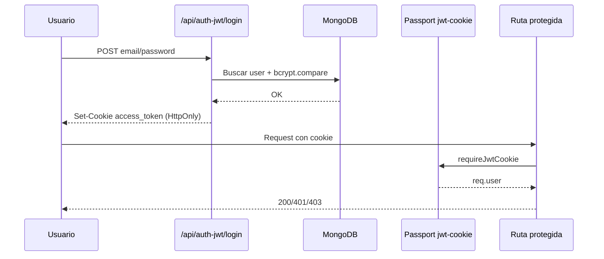
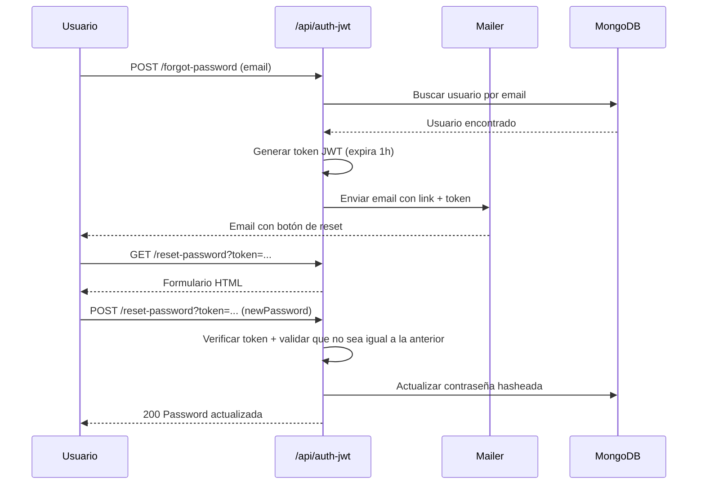
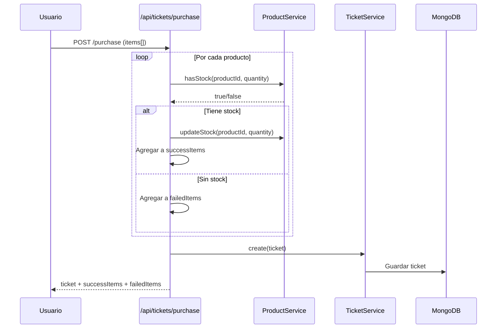

# Backend II — Trabajo Final

Servidor backend desarrollado con **Node.js**, **Express** y **MongoDB**, aplicando una arquitectura profesional en capas con patrones de diseño, autenticación JWT, sistema de mailing y lógica de ecommerce.

---

## 🛠️ Tecnologías utilizadas

- **Node.js** + **Express 5**
- **MongoDB** + **Mongoose**
- **Passport.js** (Local + GitHub OAuth + JWT)
- **JWT** (jsonwebtoken)
- **Bcrypt**
- **Nodemailer** + **Handlebars**
- **Twilio** (SMS + WhatsApp)
- **Express Session** + **connect-mongo**
- **dotenv**

---

## 📁 Arquitectura del proyecto

```
backendII_trabajoFinal/
├── src/
│   ├── config/
│   │   ├── auth/
│   │   │   └── passport.config.js
│   │   ├── db/
│   │   │   └── connect.config.js
│   │   └── env/
│   │       └── env.config.js
│   ├── controllers/
│   │   ├── mailer.controller.js
│   │   ├── messaging.controller.js
│   │   ├── order.controller.js
│   │   ├── product.controller.js
│   │   ├── student.controller.js
│   │   ├── ticket.controller.js
│   │   └── user.controller.js
│   ├── dao/
│   │   ├── base.dao.js
│   │   ├── order.mongo.dao.js
│   │   ├── product.mongo.dao.js
│   │   ├── ticket.mongo.dao.js
│   │   └── user.mongo.dao.js
│   ├── middleware/
│   │   ├── auth.middleware.js
│   │   ├── logger.middleware.js
│   │   └── policies.middleware.js
│   ├── models/
│   │   ├── dto/
│   │   │   ├── student.dto.js
│   │   │   └── user.dto.js
│   │   ├── order.model.js
│   │   ├── product.model.js
│   │   ├── students.model.js
│   │   ├── ticket.model.js
│   │   └── users.model.js
│   ├── postman/
│   │   └── Entrega Final.postman_collection.json
│   ├── repositories/
│   │   ├── order.repository.js
│   │   ├── product.repository.js
│   │   ├── ticket.repository.js
│   │   └── user.repository.js
│   ├── router/
│   │   ├── custom/
│   │   │   └── CustomRouter.js
│   │   ├── routes/
│   │   │   ├── advanced.router.js
│   │   │   ├── api.v1.router.js
│   │   │   ├── auth.router.js
│   │   │   ├── home.router.js
│   │   │   ├── jwt.router.js
│   │   │   ├── mailer.router.js
│   │   │   ├── messaging.router.js
│   │   │   ├── new.student.router.js
│   │   │   ├── order.router.js
│   │   │   ├── process.router.js
│   │   │   ├── product.router.js
│   │   │   ├── profile.router.js
│   │   │   ├── student.router.js
│   │   │   ├── ticket.router.js
│   │   │   └── user.router.js
│   │   └── router.js
│   ├── server/
│   │   ├── hbs.helper.js
│   │   └── server.app.js
│   ├── services/
│   │   ├── mailer.service.js
│   │   ├── messaging.service.js
│   │   ├── order.service.js
│   │   ├── product.service.js
│   │   ├── student.service.js
│   │   ├── ticket.service.js
│   │   └── user.service.js
│   └── views/
│       ├── emails/
│       │   ├── order-status.handlebars
│       │   ├── reset-password.handlebars
│       │   └── welcome.handlebars
│       ├── form/
│       │   └── reset-password-form.handlebars
│       ├── layouts/
│       │   └── main.handlebars
│       └── orders/
│           └── index.handlebars
├── .env
├── .gitignore
├── app.js
├── package-lock.json
├── package.json
└── README.md
```

### Flujo de capas

```
Router → Controller → Service → Repository → DAO → MongoDB
```

Cada capa tiene una responsabilidad única:

| Capa | Responsabilidad |
|------|----------------|
| **Router** | Define rutas y aplica middlewares |
| **Controller** | Maneja request/response HTTP |
| **Service** | Lógica de negocio |
| **Repository** | Acceso y consulta de datos |
| **DAO** | Queries directas a MongoDB |

---

## 🔐 Flujo de autenticación JWT



---

## 🔑 Flujo de recuperación de contraseña



---

## 🛒 Flujo de compra (Ticket)



---

## ⚙️ Instalación y configuración

### 1. Clonar el repositorio

```bash
git clone https://github.com/luqpizarro/backendII
cd backendII
```

### 2. Instalar dependencias

```bash
npm install
```

### 3. Configurar variables de entorno

Copiá el archivo `.env.example` y completá los valores:

```bash
cp .env.example .env
```

```env
PORT=8000
MONGO_URL=mongodb://localhost:27017/tu_base
MONGO_ATLAS_URL=
SECRET_SESSION=tu_secreto
MONGO_TARGET=LOCAL
JWT_SECRET=tu_jwt_secreto
NODE_ENV=development
BASE_URL=http://localhost:8000

GITHUB_CLIENT_ID=
GITHUB_CLIENT_SECRET=
GITHUB_CALLBACK_URL=http://localhost:8000/api/auth/github/callback

TWILIO_ACCOUNT_SID=
TWILIO_AUTH_TOKEN=
TWILIO_FROM_SMS=
TWILIO_FROM_WAPP=

SMTP_HOST=smtp.gmail.com
SMTP_PORT=587
SMTP_SECURE=false
SMTP_USER=
SMTP_PASS=
SMTP_FROM=
```

### 4. Iniciar el servidor

```bash
# Desarrollo
npm run dev

# Producción
npm start
```

---

## 📡 Endpoints

### 🔐 Autenticación JWT — `/api/auth-jwt`

| Método | Endpoint | Descripción | Auth |
|--------|----------|-------------|------|
| POST | `/register` | Registrar usuario | ❌ |
| POST | `/login` | Login — genera cookie JWT | ❌ |
| GET | `/current` | Usuario logueado (sin datos sensibles) | ✅ |
| POST | `/logout` | Logout — elimina cookie | ✅ |
| POST | `/forgot-password` | Envía email de recuperación | ❌ |
| GET | `/reset-password?token=` | Muestra formulario de reset | ❌ |
| POST | `/reset-password?token=` | Actualiza contraseña | ❌ |

### 📦 Productos — `/api/products`

| Método | Endpoint | Descripción | Rol |
|--------|----------|-------------|-----|
| GET | `/api/products` | Listar productos | user/admin |
| GET | `/api/products/:id` | Obtener producto por ID | user/admin |
| POST | `/api/products` | Crear producto | admin |
| PUT | `/api/products/:id` | Actualizar producto | admin |
| DELETE | `/api/products/:id` | Eliminar producto | admin |
| POST | `/api/products/seed` | Semilla de productos | admin |

### 🎟️ Tickets — `/api/tickets`

| Método | Endpoint | Descripción | Rol |
|--------|----------|-------------|-----|
| POST | `/api/tickets/purchase` | Realizar compra | user |
| GET | `/api/tickets/my-tickets` | Ver mis tickets | user/admin |

### 📋 Órdenes — `/api/orders`

| Método | Endpoint | Descripción | Rol |
|--------|----------|-------------|-----|
| GET | `/api/orders` | Listar órdenes | ✅ |
| GET | `/api/orders/:id` | Obtener orden por ID | user/admin |
| POST | `/api/orders` | Crear orden | admin |
| PUT | `/api/orders/:id` | Actualizar orden | admin |
| DELETE | `/api/orders/:id` | Eliminar orden | admin |

### 📧 Mailing — `/api/mail`

| Método | Endpoint | Descripción |
|--------|----------|-------------|
| POST | `/api/mail/welcome` | Enviar email de bienvenida |
| POST | `/api/mail/order-status` | Enviar email de estado de orden |

### 💬 Mensajería — `/api/messaging`

| Método | Endpoint | Descripción |
|--------|----------|-------------|
| POST | `/api/messaging/sms` | Enviar SMS |
| POST | `/api/messaging/whatsapp` | Enviar WhatsApp |
---

## 🧪 Ejemplos de uso en Postman

### Registro
```json
POST /api/auth-jwt/register
{
    "first_name": "Lucas",
    "last_name": "Pizarro",
    "email": "usuario@gmail.com",
    "password": "123456",
    "age": 25
}
```

### Login
```json
POST /api/auth-jwt/login
{
    "email": "usuario@gmail.com",
    "password": "123456"
}
```

### Recuperar contraseña
```json
POST /api/auth-jwt/forgot-password
{
    "email": "usuario@gmail.com"
}
```

### Reset de contraseña
```json
POST /api/auth-jwt/reset-password?token=eyJ...
{
    "newPassword": "nuevaPassword123"
}
```

### Compra
```json
POST /api/tickets/purchase
{
    "items": [
        { "productId": "ID_DEL_PRODUCTO", "quantity": 2 },
        { "productId": "ID_OTRO_PRODUCTO", "quantity": 1 }
    ]
}
```

### Crear producto (solo admin)
```json
POST /api/products
{
    "title": "Teclado Mecánico",
    "description": "Teclado RGB",
    "price": 15000,
    "stock": 10,
    "category": "perifericos"
}
```

---

## 🛡️ Sistema de roles

| Rol | Permisos |
|-----|----------|
| **user** | Ver productos, realizar compras, ver sus tickets |
| **admin** | Crear/editar/eliminar productos, ver todas las órdenes |

---

## 📬 Sistema de mailing

El servidor utiliza **Nodemailer** con **Gmail SMTP** y templates **Handlebars** para enviar:

- ✅ Email de bienvenida
- ✅ Email de estado de orden
- ✅ Email de recuperación de contraseña con link que expira en 1 hora

---

## 👤 Autor

**Lucas Pizarro** — Backend II — 2026
